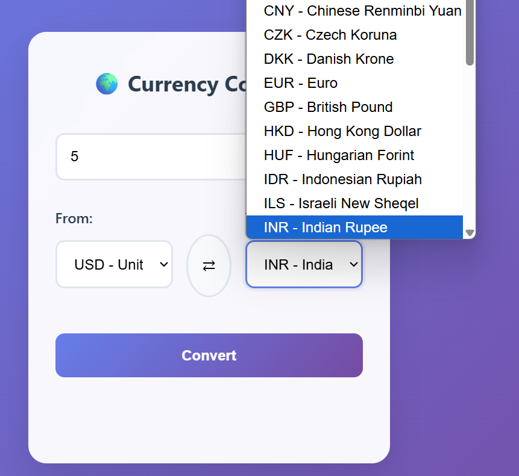

# 💱 Currency Converter

A sleek, responsive web-based currency converter that fetches real-time exchange rates using the [Frankfurter API](https://www.frankfurter.app/). Convert between 50+ currencies with ease!

  
*(Main interface with default currencies)*

## ✨ Features
- Real-time exchange rates via API
- Swap currencies with one click
- Clean, mobile-friendly UI with gradient background
- Error handling and input validation
- Keyboard support (press Enter to convert)

## 🛠️ Tech Stack
- **Frontend**: HTML5, CSS3, JavaScript (Vanilla JS)
- **API**: [Frankfurter](https://www.frankfurter.app/) (free & no API key required)
- **Hosting**: GitHub Pages (optional)

## 📸 Screenshots

| Step | Preview |
|------|---------|
| **1. Enter Amount** |  |
| **2. Select Currencies** |  |
| **3. Conversion Result** |  |

## 🚀 Quick Start

1. Clone the repo:
   ```bash
   git clone https://github.com/saikiran9346/Currency-converter/tree/main
 2.Open index.html in your browser.

## 🔧 How It Works

  - Fetches currency list from API on page load
  - Validates user input (amount > 0, currencies selected)
  - Makes API call to convert:
  - js
     ```bash
       GET https://api.frankfurter.app/latest?amount=10&from=USD&to=EUR
     
  - Displays result with proper formatting
## Project Structure
- `index.html` — HTML file
- `stycle.css` — CSS file
- `script.js` — javascrpt file
## Author
- saikiran9346
- [Your GitHub Profile](https://github.com/saikiran9346)
